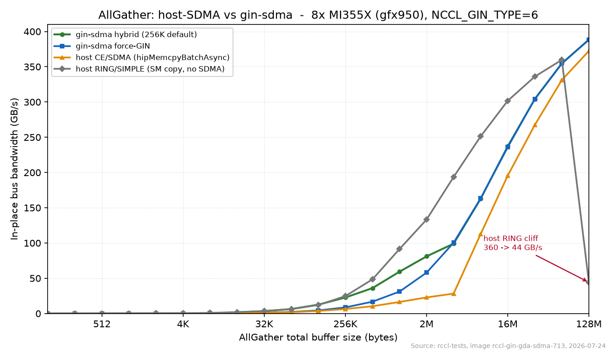

# AllGather: host-SDMA vs gin-sdma — bandwidth and CU usage

Benchmark of RCCL AllGather paths on **8× MI355X (gfx950)**, single node xGMI.

- Image: `rccl-gin-gda-sdma-713`
- Tool: `rccl-tests/all_gather_perf`, `-g 1 -n 10 -w 3`, `NCCL_GIN_TYPE=6`
- Date: 2026-07-24
- Metric: in-place bus bandwidth (GB/s), higher is better. "Size" = total AllGather buffer in bytes.

## Configurations

| Path | Config |
|---|---|
| host CE/SDMA | `-D 0`, `NCCL_CUMEM_ENABLE=1`, `-R 2`, `NCCL_CTA_POLICY=ZERO` |
| host RING/SIMPLE (gate baseline) | `-D 0`, `NCCL_CUMEM_ENABLE=0`, `-R 0` |
| gin-sdma hybrid | `-D 3 -V 8 -R 2` (256 KiB/rank LSA→SDMA default) |
| gin-sdma force-GIN | `-D 3 -V 8 -R 2`, `NCCL_GIN_ANVIL_SDMA_THRESHOLD_ALLGATHER=0` |

## Bandwidth chart

In-place bus bandwidth (GB/s) vs total AllGather buffer size (log2 x-axis). gin-sdma tops out at
388 GB/s and never cliffs; host RING/SIMPLE leads in the mid-range via non-SDMA SM copies but
collapses to 44 GB/s at 128 MiB; host CE/SDMA (copy engines) trails at every size.

## Full sweep — in-place bus bandwidth (GB/s)

| Size | host CE/SDMA | host RING/SIMPLE | gin-sdma hybrid | gin-sdma force-GIN |
|---|---:|---:|---:|---:|
| 128 B | 0.00 | 0.01 | 0.01 | 0.01 |
| 256 B | 0.01 | 0.02 | 0.01 | 0.01 |
| 512 B | 0.01 | 0.06 | 0.05 | 0.03 |
| 1 KiB | 0.03 | 0.11 | 0.11 | 0.05 |
| 2 KiB | 0.06 | 0.26 | 0.21 | 0.07 |
| 4 KiB | 0.12 | 0.50 | 0.31 | 0.14 |
| 8 KiB | 0.24 | 0.89 | 0.38 | 0.28 |
| 16 KiB | 0.48 | 1.95 | 1.69 | 0.56 |
| 32 KiB | 0.95 | 3.62 | 3.32 | 1.11 |
| 64 KiB | 1.83 | 6.27 | 6.33 | 2.22 |
| 128 KiB | 3.57 | 12.11 | 12.55 | 4.40 |
| 256 KiB | 6.38 | 24.70 | 22.74 | 8.68 |
| 512 KiB | 10.33 | 48.45 | 36.01 | 16.75 |
| 1 MiB | 16.34 | 91.42 | 59.31 | 31.07 |
| 2 MiB | 22.83 | 133.23 | 81.04 | 57.95 |
| 4 MiB | 28.25 | 193.67 | 99.08 | 100.40 |
| 8 MiB | 112.68 | 251.30 | 162.80 | 163.31 |
| 16 MiB | 195.56 | 301.70 | 237.09 | 235.81 |
| 32 MiB | 267.33 | 336.00 | 304.06 | 304.17 |
| 64 MiB | 331.11 | 359.77 | 354.53 | 354.82 |
| 128 MiB | 372.37 | **44.29** (cliff) | **388.57** | 388.17 |

### Bandwidth findings

- **SDMA-vs-SDMA: gin-sdma wins at every size.** Host CE/SDMA genuinely uses SDMA
  (`hipMemcpyBatchAsync` on the copy engines) but trails gin-sdma across the whole range
  (e.g. 8 MiB: 113 vs 163; 64 MiB: 331 vs 355; 128 MiB: 372 vs 389). CE also has heavy
  per-op overhead and only ramps past ~8 MiB.
- **Where host "beats" gin-sdma it is NOT using SDMA.** The host advantage in ~512 KiB–64 MiB
  comes from the RING/SIMPLE **SM-copy** path, not the copy engines.
- **host RING cliffs at 128 MiB** (360 → 44 GB/s), while both gin-sdma variants stay at ~388
  and never cliff.
- **Hybrid default validated:** it matches force-GIN at ≥4 MiB and adds LSA wins in the
  512 KiB–2 MiB band (1 MiB: 59 vs 31).

## Small-message latency: the three-tier LSA design (gin-sdma `-D 3`)

The bandwidth table above (2026-07-24) predates the small-message latency work. `GinHybridAllGatherKernel` now tiers the sub-threshold (LSA) regime into three paths, selected by per-rank `chunkBytes` (all on 8× MI355X `NCCL_GIN_TYPE=6`, `-V 8`):

| Per-rank chunk | Total (NP=8) | Path | Transport | Sync |
|---|---|---|---|---|
| ≤ 4 KiB | ≤ 32 KiB | **LL** packed data+flag (`AllGatherLLImpl`, single CTA) | xGMI GPU store into epoch-tagged LL scratch | per-slot epoch tag, **no barrier** |
| ≤ 8 KiB | ≤ 64 KiB | vectorized LSA, **single CTA** | xGMI GPU store → peer recvbuff | 2 LSA barriers |
| ≤ 256 KiB | ≤ 2 MiB | vectorized LSA, all CTAs | xGMI GPU store → peer recvbuff | 2 LSA barriers |
| > 256 KiB | > 2 MiB | GIN puts | SDMA copy engines over xGMI | receiver `waitSignal` |

**LL (low-latency) fast path (fix C).** Each rank `bcast`s its chunk (as 8-byte units) into an epoch-tagged LL scratch buffer (`ncclLLA2ASession`) and `recv`s every rank's chunk out of its **own** scratch into its **local** `recvbuff`. This removes **both** LSA barriers: cross-rank traffic lives entirely in the LL scratch, ordered by the per-slot epoch tag, and no rank ever writes a peer's `recvbuff`.

- **Why not just drop a barrier from the LSA copy.** The two LSA barriers are not both removable. rccl-tests' datacheck loop `Barrier`s (host/MPI only) *before* `initData` but not between `initData`'s `cudaMemset(recvbuff)` and the kernel launch, so the in-kernel **entry** barrier is what guarantees all ranks are past their memset before any peer writes their `recvbuff`. Dropping it lets a fast rank's direct-LSA write get clobbered by a slow rank's memset — reproduced on MI355X as intermittent ~3.5K wrong elements. LL sidesteps this because cross-rank writes never touch `recvbuff`.
- **Cutoff = 4 KiB/rank.** LL doubles wire volume (16-byte line = 8 B data + 2× epoch words), so it only wins while latency-bound: LL beats the single-CTA vectorized LSA up to 4 KiB/rank (32 KiB total: 12.2 vs 13.2 µs) but loses at 8 KiB/rank (64 KiB total: 19.0 vs 13.5 µs). Tunable via `ALLGATHER_LL_MAX_BYTES`.

### Latency (out-of-place, µs; lower is better), 2026-07-26

| Total (NP=8) | Per-rank | LSA baseline (A+B) | LL fix C | Δ | Path |
|---|---|---:|---:|---:|---|
| 128 B | 16 B | 13.3 | **10.2** | −23% | LL |
| 2 KiB | 256 B | 13.7 | **10.6** | −22% | LL |
| 8 KiB | 1 KiB | ~13 | **10.6** | −18% | LL |
| 16 KiB | 2 KiB | ~13 | **11.4** | −13% | LL |
| 32 KiB | 4 KiB | 13.2 | **12.2** | −7% | LL (last) |
| 64 KiB | 8 KiB | ~13.7 | 13.7 | 0 | vectorized LSA |

Correctness `#wrong=0` across repeated runs (LL is race-free by construction). All three tiers use **GPU + xGMI only** — no host proxy during the operation (`needsProxyProgress=0` for Anvil-SDMA; the SDMA path is GPU-initiated: the shader rings the SDMA-queue doorbell, the on-die copy engines DMA over xGMI, completion via GPU atomic signal).

## Compute units (CUs) used per GPU

All paths use persistent 1-workgroup-per-CU kernels, so **CUs ≈ CTAs (thread blocks) launched**.
MI355X has 256 CUs total. Measured at 128 MiB via `NCCL_DEBUG=INFO`.

| Path | Launch geometry | CTAs = CUs | Threads/CTA | % of 256 CUs | Data mover |
|---|---|---:|---:|---:|---|
| host CE/SDMA | `CTA_POLICY=ZERO` → `hipMemcpyBatchAsync` (numOps=7) | 0 | — | 0% | SDMA copy engines |
| host RING/SIMPLE | `RING/SIMPLE channel{0..15}` | 16 | 256 | 6.3% | GPU SM (xGMI) |
| gin-sdma hybrid | `kernel<<<8, 512>>>` (`-V 8`) | 8 | 512 | 3.1% | SM (LSA) + SDMA (1 ch) |
| gin-sdma force-GIN | `kernel<<<8, 512>>>` (`-V 8`) | 8 | 512 | 3.1% | SDMA queue (1 ch) |

### Evidence

- **host CE/SDMA** — `Comm config CTAPolicy reset to NCCL_CTA_POLICY=2` and
  `AllGather [Copy Engine]: ... hipMemcpyBatchAsync, numOps=7`. `POLICY_ZERO` launches
  **no compute CTAs**; the 7 peer copies run entirely on the SDMA copy engines.
  (~0 CUs; only a small IPC barrier touches the SMs during setup.)
- **host RING/SIMPLE** — `AllGather: 16777216 Bytes -> Algo RING proto SIMPLE channel{Lo..Hi}={0..15}`
  → 16 channels = 16 blocks, 256 threads each (Simple `Max NThreads=256`).
- **gin-sdma** — rccl-tests launches `kernel<<<deviceCtaCount, 512>>>`; `-V 8` sets
  `deviceCtaCount=8` → 8 blocks, 512 threads. Plugin uses
  `standalone SDMA queues (8 ranks, 1 ch)` for the SDMA transfers.
  (`-V`/`--device_cta_count` default is 16.)

### CU-efficiency implication

- **gin-sdma reaches peak bandwidth (388 GB/s) using only 8 CUs (~3%)** — half of host RING's
  16 CUs — leaving more of the GPU free for overlapping compute.
- **host RING** needs 16 CUs (~6%) and still cliffs at 128 MiB.
- **host CE/SDMA** uses ~0 CUs but is the slowest path (all copy engine, no compute occupancy).
- gin-sdma's CU count is tunable via `-V` (default 16); this benchmark used `-V 8`.

## Bottom line

Against the host **SDMA** path (Copy Engine), gin-sdma is strictly faster at every size **and**
uses fewer/comparable CUs. The host only edges ahead via the non-SDMA SM ring at mid sizes, and
that path collapses at 128 MiB. gin-sdma is both the fastest at large sizes and the most
CU-efficient.
